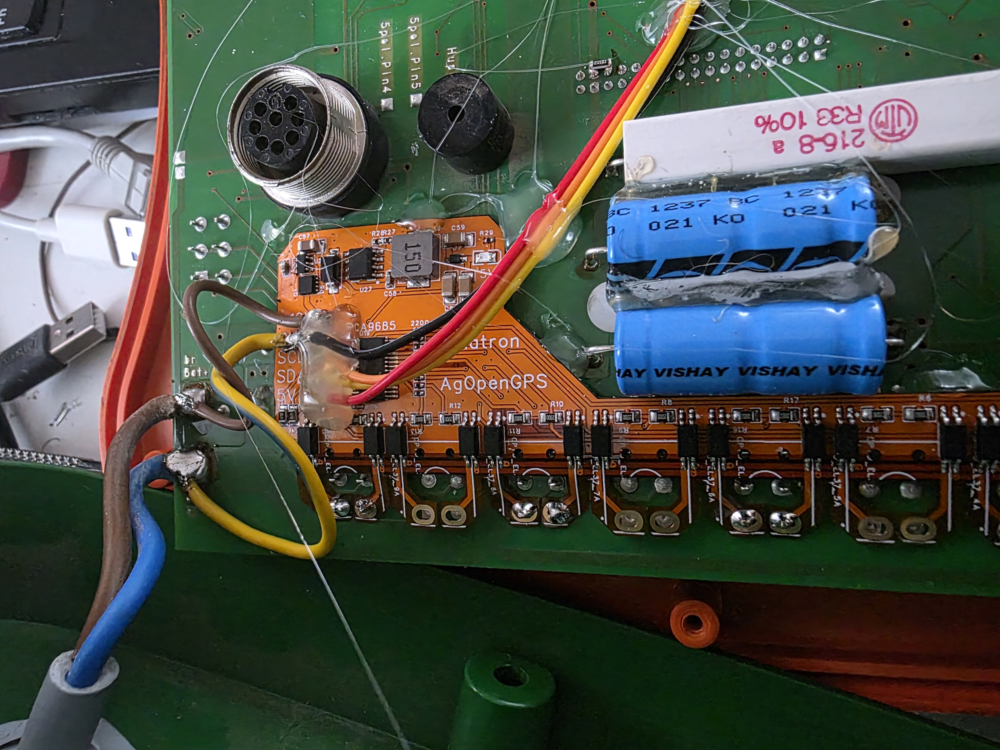
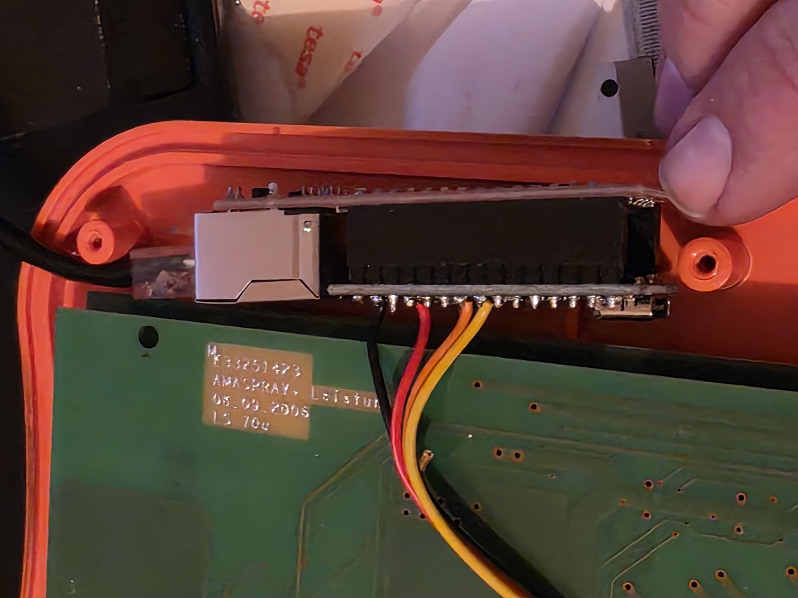

What is this?

A flexPCB for Amaspray+ that allows sections to be controlled over I2C from AgOpenGPS.

Currently it works over UDP and requires an Arduino Nano + Ethernet header.

TODO: 
 + Split the BOM so we could order 5-7-9 section versions?
 + Find / make a microcontroller that fits better inside the amaspray. 
 	Arduino Nano with ethernet seems an okay choice.
 	ESP32-S3 + CAN would also make it feasible for ISOBUS TaskController on the long run

PCB:
 12V -> 5V power supply
 PCA9685 over I2C (0x40 address)
 9 sections with double optocouplers

 Designed in EasyEDA Pro (because of FlexPCB)
 Likely would be a lot cheaper with regular PCB but mounting it would be more challenging.

Wiring:
 The Amaspray part kinda self explanatory
 GND / 16V are the same order as on amaspray

  5V, GND to the same labels on Arduino
  SDA to A4
  SCL to A5

Changes:
2026-01-19 Updated the PCB to have extra pads for connecting Arduino NANO, also updated the labels to match Arduino Nano.
